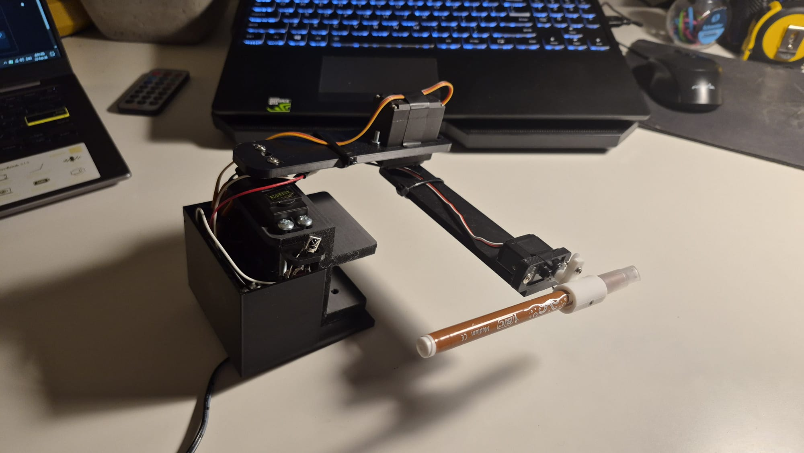

# Drawing-Robot

A servo-controlled drawing robot powered by an ESP8266. The robot uses inverse kinematics to accurately position a pen and draw shapes, with control provided via an IR remote.

Watch Demo:
https://youtu.be/79JGTEXYeSc?is=7HhXlH1j8jswO96r

# Features
Servo-based 2D drawing mechanism
Inverse kinematics for precise positioning
IR remote control for interaction
Wireless, self-contained system
# Hardware
ESP8266
Servo motors
IR receiver + remote
Mechanical drawing frame
Power supply
# How it works
The robot computes the required servo angles using inverse kinematics to reach a target point in a 2D plane. Commands received from the IR remote define movements or drawing actions, which are translated into coordinated servo motion.
# Setup
Assemble the mechanical structure
Connect servos and IR receiver to the ESP8266
Upload the code
Use the remote to control drawing
# Notes
Calibration is important for accuracy
Inverse kinematics allows smooth and precise motion
Can be extended with predefined drawings or automated patterns
